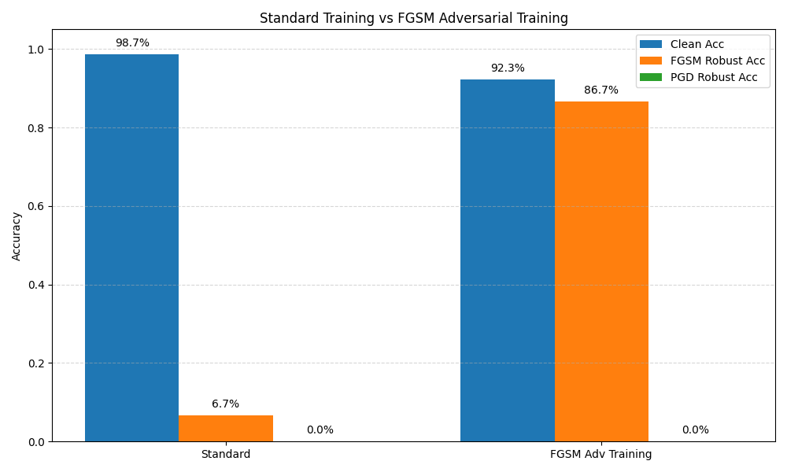
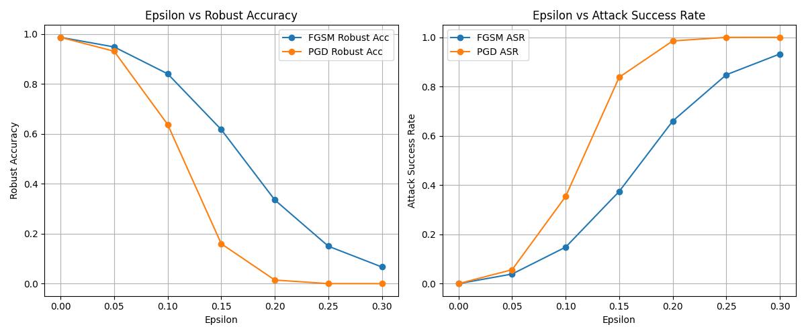
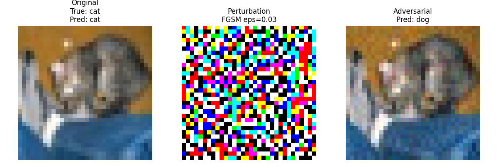
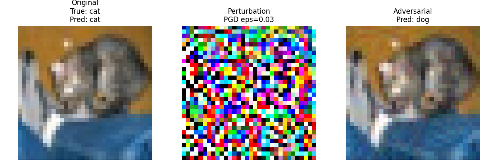

# 图像分类对抗样本攻击与鲁棒性评估平台

基于 PyTorch 的图像分类对抗攻击与鲁棒性评估平台，支持 MNIST 和 CIFAR-10 上的 FGSM / PGD 白盒攻击、鲁棒性指标评估、攻击强度曲线分析和对抗样本可视化。

## 项目简介

本项目围绕图像分类模型的对抗攻击与鲁棒性评估展开，覆盖 MNIST 灰度手写数字和 CIFAR-10 彩色自然图像两个数据集。项目提供模型训练、白盒攻击生成、鲁棒性指标统计、攻击强度曲线绘制和对抗样本可视化，用于分析模型在不同扰动强度下的性能变化。

## 项目亮点

- 支持 MNIST 与 CIFAR-10 两类图像分类任务。
- 实现 FGSM 和 PGD 两种经典白盒对抗攻击。
- 记录 Clean Acc、Robust Acc、Attack Success Rate 三类评估指标。
- 提供攻击强度曲线，直观展示 `epsilon` 对鲁棒性的影响。
- 加入 FGSM 对抗训练，对比标准训练和对抗训练后的鲁棒性变化。
- 展示 MNIST 与 CIFAR-10 对抗样本，包含原图、扰动和攻击后图片。
- README 中结果来自项目脚本实际运行，没有伪造新指标。

## 项目结构

```text
adversarial_image_lab/
|-- attacks/
|   |-- fgsm.py
|   |-- pgd.py
|-- checkpoints/
|   |-- adv_simple_cnn_mnist.pth
|   |-- best_cifar10_deep_cnn.pth
|-- eval/
|   |-- metrics.py
|-- models/
|   |-- cifar_deep_cnn.py
|   |-- simple_cnn.py
|-- results/
|   |-- adv_training_comparison.png
|   |-- attack_curve_compare.png
|   |-- adv_training_comparison.csv
|   |-- cifar_fgsm_eps_0.03_example.png
|   |-- cifar_pgd_eps_0.03_example.png
|   |-- fgsm_eps_0.3_example.png
|   |-- pgd_eps_0.3_example.png
|-- utils/
|   |-- visualize.py
|-- evaluate_attack.py
|-- evaluate_cifar_attack.py
|-- plot_adv_training_comparison.py
|-- plot_attack_curve.py
|-- requirements.txt
|-- train.py
|-- train_adv_mnist.py
|-- visualize_attack.py
|-- visualize_cifar_attack.py
|-- README.md
```

## 环境安装

```bash
pip install -r requirements.txt
```

依赖包括：

```text
torch
torchvision
matplotlib
pillow
numpy
```

## 使用方法

训练 MNIST 模型：

```bash
python train.py --epochs 3
```

训练 MNIST FGSM 对抗训练模型：

```bash
python train_adv_mnist.py --epochs 5 --epsilon 0.3
```

评估 MNIST 干净准确率：

```bash
python evaluate_attack.py --attack none --model-path simple_cnn_mnist.pth
```

运行 MNIST FGSM：

```bash
python evaluate_attack.py --attack fgsm --epsilon 0.3 --model-path simple_cnn_mnist.pth
```

运行 MNIST PGD：

```bash
python evaluate_attack.py --attack pgd --epsilon 0.3 --alpha 0.01 --steps 40 --model-path simple_cnn_mnist.pth
```

运行 CIFAR-10 干净准确率：

```bash
python evaluate_cifar_attack.py --attack none
```

运行 CIFAR-10 FGSM：

```bash
python evaluate_cifar_attack.py --attack fgsm --epsilon 0.03
```

运行 CIFAR-10 PGD：

```bash
python evaluate_cifar_attack.py --attack pgd --epsilon 0.03 --alpha 0.005 --steps 20
```

生成 MNIST 对抗样本可视化：

```bash
python visualize_attack.py --model-path simple_cnn_mnist.pth
```

生成 CIFAR-10 对抗样本可视化：

```bash
python visualize_cifar_attack.py --attack fgsm --epsilon 0.03 --index 0
python visualize_cifar_attack.py --attack pgd --epsilon 0.03 --alpha 0.005 --steps 20 --index 0
```

生成攻击强度曲线：

```bash
python plot_attack_curve.py --model-path simple_cnn_mnist.pth
```

生成对抗训练对比图：

```bash
python plot_adv_training_comparison.py
```

## MNIST 结果

MNIST 使用 `SimpleCNN`，模型权重为 `simple_cnn_mnist.pth`。以下结果来自脚本实际运行。

| Model | Attack | Epsilon | Alpha | Steps | Clean Acc | Robust Acc | Attack Success Rate |
|---|---|---:|---:|---:|---:|---:|---:|
| SimpleCNN | None | 0 | - | - | 98.71% | - | - |
| SimpleCNN | FGSM | 0.1 | - | 1 | 98.71% | 84.08% | 14.82% |
| SimpleCNN | FGSM | 0.2 | - | 1 | 98.71% | 33.54% | 66.02% |
| SimpleCNN | FGSM | 0.3 | - | 1 | 98.71% | 6.67% | 93.24% |
| SimpleCNN | PGD | 0.3 | 0.01 | 40 | 98.71% | 0.00% | 100.00% |

## MNIST 对抗训练结果

对抗训练使用 `train_adv_mnist.py`，训练命令如下：

```bash
python train_adv_mnist.py --epochs 5 --epsilon 0.3
```

训练完成后生成权重：

```text
checkpoints/adv_simple_cnn_mnist.pth
```

本次训练中，最佳 Clean Test Acc 为 `95.16%`。随后使用 `evaluate_attack.py` 对该权重进行评估，结果如下：

| Model | Training Method | Clean Acc | FGSM Robust Acc | PGD Robust Acc |
|---|---|---:|---:|---:|
| SimpleCNN | Standard | 98.71% | 6.67% | 0.00% |
| SimpleCNN | FGSM Adv Training | 92.32% | 86.71% | 0.00% |

对比图如下：



可以看到，FGSM 对抗训练显著提高了模型在 FGSM 攻击下的鲁棒准确率，从 `6.67%` 提升到 `86.71%`。同时，干净准确率从 `98.71%` 降到 `92.32%`，说明对抗训练会带来一定的 clean accuracy 代价。PGD Robust Acc 仍为 `0.00%`，说明仅使用 FGSM 对抗训练还不足以抵抗更强的多步 PGD 攻击。

## CIFAR-10 结果

CIFAR-10 使用 `CIFAR10DeepCNN`，权重文件为 `checkpoints/best_cifar10_deep_cnn.pth`。该权重来自另一个图像分类项目 `cnn_image_classification_lab`。

| Model | Attack | Epsilon | Alpha | Steps | Clean Acc | Robust Acc | Attack Success Rate |
|---|---|---:|---:|---:|---:|---:|---:|
| CIFAR10DeepCNN | None | 0 | - | - | 85.33% | 85.33% | 0.00% |
| CIFAR10DeepCNN | FGSM | 0.03 | - | 1 | 85.33% | 4.87% | 94.33% |
| CIFAR10DeepCNN | PGD | 0.03 | 0.005 | 20 | 85.33% | 0.00% | 100.00% |

## 攻击强度曲线

攻击强度曲线展示了 MNIST 上 FGSM 与 PGD 在多个 `epsilon` 下的鲁棒准确率和攻击成功率变化。



左图是 `epsilon` 与 `Robust Acc` 的关系，右图是 `epsilon` 与 `Attack Success Rate` 的关系。`epsilon` 越大，扰动越强；通常会看到 Robust Acc 越低，ASR 越高。PGD 是多步迭代攻击，通常比 FGSM 更强。

## MNIST 对抗样本可视化

MNIST 是单通道灰度图，输入形状为 `[1, 28, 28]`。下图展示原始图片、扰动和攻击后的图片。

FGSM，`epsilon=0.3`：


PGD，`epsilon=0.3`，`alpha=0.01`，`steps=40`：


## CIFAR-10 对抗样本可视化

CIFAR-10 是三通道彩色图，输入形状为 `[3, 32, 32]`。PyTorch 使用 `[C, H, W]`，而 matplotlib 显示图片需要 `[H, W, C]`，因此可视化时需要执行：

```python
image = image.permute(1, 2, 0)
```

以下样本中，干净图片预测正确，加入扰动后模型预测错误，适合用于展示自然图像模型对小扰动的敏感性。

FGSM，`epsilon=0.03`：



PGD，`epsilon=0.03`，`alpha=0.005`，`steps=20`：



## 核心原理：FGSM、PGD、Clean Acc、Robust Acc、ASR

FGSM 是一步梯度符号攻击。它计算损失函数对输入图片的梯度，并沿着让损失增大的方向修改像素：

```text
x_adv = x + epsilon * sign(gradient_x J(theta, x, y))
```

PGD 可以看作多步版本的 FGSM。它每次走一小步，并把扰动投影回 `epsilon` 限制范围内：

```text
x_adv = x_adv + alpha * sign(gradient_x J(theta, x_adv, y))
perturbation = clamp(x_adv - x, -epsilon, epsilon)
x_adv = clamp(x + perturbation, 0, 1)
```

Clean Acc 表示模型在干净测试集上的准确率，用于衡量正常分类能力。

Robust Acc 表示模型在对抗样本上的准确率，用于衡量攻击下仍能预测正确的比例。

ASR 是 Attack Success Rate，即攻击成功率。一般情况下，Robust Acc 越低，ASR 越高。

## 结论

- MNIST 上，SimpleCNN 的 Clean Acc 为 `98.71%`，正常分类能力较好。
- MNIST 上，FGSM 的 `epsilon` 从 `0.1` 增大到 `0.3` 时，Robust Acc 从 `84.08%` 降到 `6.67%`，说明扰动越大攻击越强。
- MNIST 上，PGD 在 `epsilon=0.3` 时将 Robust Acc 降到 `0.00%`，攻击强度高于 FGSM。
- MNIST 上，FGSM 对抗训练将 FGSM Robust Acc 从 `6.67%` 提升到 `86.71%`，但 PGD Robust Acc 仍为 `0.00%`。
- CIFAR-10 上，CIFAR10DeepCNN 的 Clean Acc 为 `85.33%`，但 FGSM 在 `epsilon=0.03` 下就能将 Robust Acc 降到 `4.87%`。
- CIFAR-10 自然图像模型也容易受到小扰动攻击；PGD 在当前参数下将 Robust Acc 降到 `0.00%`，ASR 达到 `100.00%`。

## 后续优化方向

- 使用 ResNet、VGG 等更强的图像分类模型进行对比。
- 加入对抗训练，提升模型在 FGSM / PGD 下的鲁棒性。
- 扩展更多攻击方法，例如 CW、DeepFool、AutoAttack。
- 对 CIFAR-10 也绘制不同 `epsilon` 下的攻击强度曲线。
- 更严格地统计 ASR，例如只统计干净样本原本预测正确的样本。
- 增加批量导出结果表格和自动生成报告功能。
